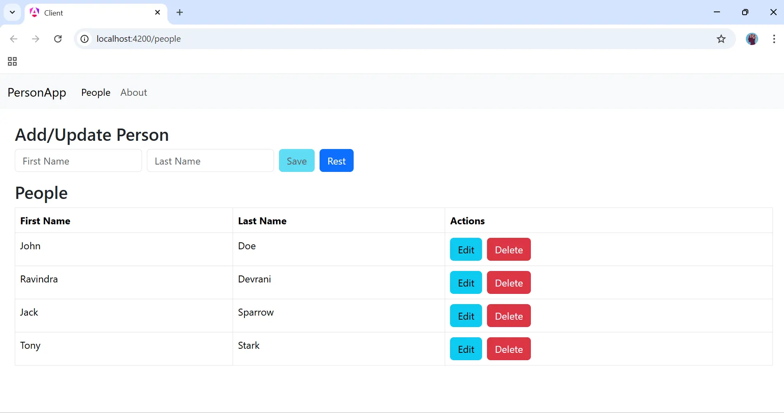

# Dotnet and Angular fullstack project

## Tech used

- Dotnet 9.0
- Sqlite
- Entity FrameworkCore
- Angular 20
- Bootstrap 5
- Signals

## How to run the project

- Clone the project
- Open the `PersonCrud` folder in VsCode. 
- Visit to `PersonCrud.Api` in terminal and run command `dotnet ef database update` which will create a database with some data. 
- Now run the project with `dotnet run`
- Open client app in Vs Code. Open this folder in terminal and type `ng serve --open`  

## Screenshots

